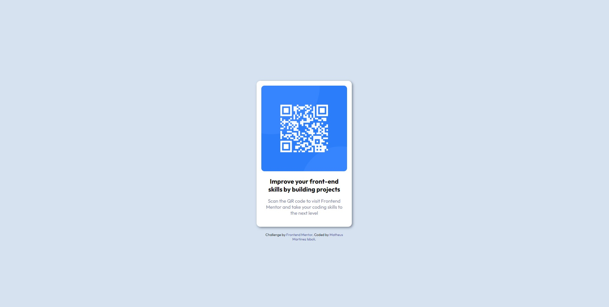

## Conteúdo

- [Overview](#overview)
  - [Screenshot](#screenshot)
- [Meu Processo](#meu-processo)
  - [Feito com](#feito-com)
  - [O que aprendi](#o-que-aprendi)
  - [Continued development](#continued-development)
- [Autor](#autor)

## Overview

### Screenshot

## Meu Processo

### Feito com

- Semantic HTML5 markup
- CSS custom properties
- Flexbox
- CSS Grid
- Mobile-first workflow

### O que aprendi

Usar um pouco melhor o flexbox e praticando HTML5 e CSS3 para manter sempre o conhecimento sobre a área atualizado. Mesmo com projetos simples sempre aprendo a usar funções novas.

## Autor

- GitHub - [Matheus Martinez Isboli](https://github.com/mthm93)
- Frontend Mentor - [@mthm93](https://www.frontendmentor.io/profile/mthm93)
- Twitter - [@mthm93](https://www.twitter.com/mthm93)
